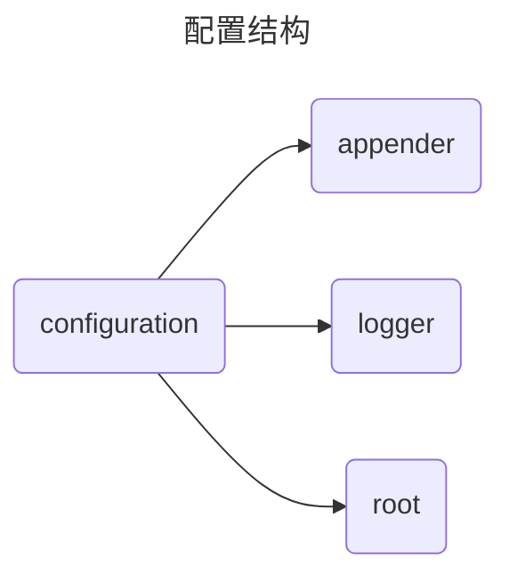

<h1>logback-study</h1>

[spring boot logback](https://springdoc.cn/spring-boot-logging-tutorial/)


# 简介

logback 是基于 log4j 进一步优化的，具有更稳定、更灵活的特点。

Spring Boot 默认使用 logback，已经自带了 logback 相关的依赖。

logback 有三个模块：

- logback-core：其他俩模块基础模块，作为通用模块 其中没有 logger 的概念
- logback-classic：日志模块，完整实现了 SLF4J API
- logback-access：配合 Servlet 容器，提供 HTTP 访问日志功能


# 配置



```xml
<configuration scan="true" scanPeriod="60 seconds" debug="false">  
    <property name="service-name" value="service1" /> 
    <contextName>${service-name}</contextName> 
    
    <appender>
        //xxxx
    </appender>   
    
    <logger>
        //xxxx
    </logger>
    
    <root>             
       //xxxx
    </root>  
</configuration>  
```

## configuration

- scan：当此属性设置为 true 时，配置文件如果发生改变，将会被重新加载，默认值为 true。
- scanPeriod：设置监测配置文件是否有修改的时间间隔，如果没有给出时间单位，默认单位是毫秒。当scan为true时，此属性生效。默认的时间间隔为 1 分钟。
- debug：当此属性设置为 true 时，将打印出 logback 内部日志信息，实时查看 logback 运行状态。默认值为false。

## property

用来定义变量值的标签，`property` 标签有两个属性，`name` 和 `value`；其中 `name` 的值是变量的名称，`value` 的值时变量定义的值。通过 `property` 定义的值会被插入到 `logger` 上下文中。定义变量后，可以使“${name}”来使用变量。如上面的 xml所示。

## contextName

每个 `logger` 都关联到 `logger` 上下文，默认上下文名称为 `default`。但可以使用 `contextName` 标签设置成其他名字，用于区分不同应用程序的记录。

## appender

`appender` 是一个日志打印的组件，这里组件里面定义了打印过滤的条件、打印输出方式、滚动策略、编码方式、打印格式等等。但是它仅仅是一个打印组件，如果我们不使用一个 `logger` 或者 `root` 的 `appender-ref` 指定某个具体的 `appender` 时，它就没有什么意义。

- ConsoleAppender：把日志添加到控制台
- FileAppender：把日志添加到文件
- RollingFileAppender：滚动记录文件，先将日志记录到指定文件，当符合某个条件时，将日志记录到其他文件。它是FileAppender的子类

### filter

`filter` 其实是 `appender` 里面的子元素。它作为过滤器存在，执行一个过滤器会有返回 `DENY`，`NEUTRAL`，`ACCEPT` 三个枚举值中的一个。

- DENY：日志将立即被抛弃不再经过其他过滤器
- NEUTRAL：有序列表里的下个过滤器过接着处理日志
- ACCEPT：日志会被立即处理，不再经过剩余过滤器

- ThresholdFilter：临界值过滤器，过滤掉低于指定临界值的日志。当日志级别等于或高于临界值时，过滤器返回 `NEUTRAL`；当日志级别低于临界值时，日志会被拒绝
- LevelFilter：级别过滤器，根据日志级别进行过滤。如果日志级别等于配置级别，过滤器会根据   `onMath` (用于配置符合过滤条件的操作) 和 `onMismatch` (用于配置不符合过滤条件的操作) 接收或拒绝日志。

### file

`file` 标签用于指定被写入的文件名，可以是相对目录，也可以是绝对目录，如果上级目录不存在会自动创建，没有默认值。

### rollingPolicy 

` rollingPolicy ` 标签用来描述滚动策略的。这个只有 `appender` 的 `class` 是 `RollingFileAppender` 时才需要配置。

- TimeBasedRollingPolicy：最常用的滚动策略，它根据时间来制定滚动策略，既负责滚动也负责出发滚动。一般搭配 `SizeAndTimeBasedFNATP` 根据文件大小滚动。TimeBasedRollingPolicy 包括了两个属性：
  - FileNamePattern：日志文件输出的文件名
  - maxHistory：日志文件保留天数
- SizeAndTimeBasedRollingPolicy：在 TimeBasedRollingPolicy 基础上，根据文件大小滚动
- FixedWindowRollingPolicy：根据固定窗口算法重命名文件的滚动策略。

### encoder 

对记录事件进行格式化

- 把日志信息转换成字节数组
- 把字节数组写入到输出流

## logger

用来 `name` 和 `level` 设置某一个包或者具体的某一个类的日志打印级别。还可以通过 `appender-ref` 以及指定 `appender`。

## root

根 logger，也是一种 logger，但只有一个 `level` 属性。


# 实战

## sleuth

添加依赖，打印 traceId 和 spanId

```xml
<!--actuator -->
<dependency>
    <groupId>org.springframework.boot</groupId>
    <artifactId>spring-boot-starter-actuator</artifactId>
</dependency>
<!-- micrometer-tracing -->
<dependency>
    <groupId>io.micrometer</groupId>
    <artifactId>micrometer-tracing</artifactId>
</dependency>
<dependency>
    <groupId>io.micrometer</groupId>
    <artifactId>micrometer-tracing-bridge-brave</artifactId>
</dependency>
```

```yaml
server:
  port: 8001
  servlet:
    context-path: /

spring:
  application:
    name: service
  profiles:
    active: '@profileActive@'

management:
  tracing:
    sampling:
      probability: 1.0
```

 [logback-sleuth-common.xml](service\src\main\resources\logback-sleuth-common.xml) 

 [logback-spring.xml](service\src\main\resources\logback-spring.xml) 

## skywalking

```xml
<!-- skywalking trace -->
<dependency>
    <groupId>org.apache.skywalking</groupId>
    <artifactId>apm-toolkit-trace</artifactId>
    <version>9.1.0</version>
</dependency>
<!-- skywalking logback -->
<dependency>
    <groupId>org.apache.skywalking</groupId>
    <artifactId>apm-toolkit-logback-1.x</artifactId>
    <version>9.1.0</version>
</dependency>
```

 [logback-skywalking-common.xml](service\src\main\resources\logback-skywalking-common.xml) 

 [logback-sleuth-common.xml](service\src\main\resources\logback-sleuth-common.xml) 
